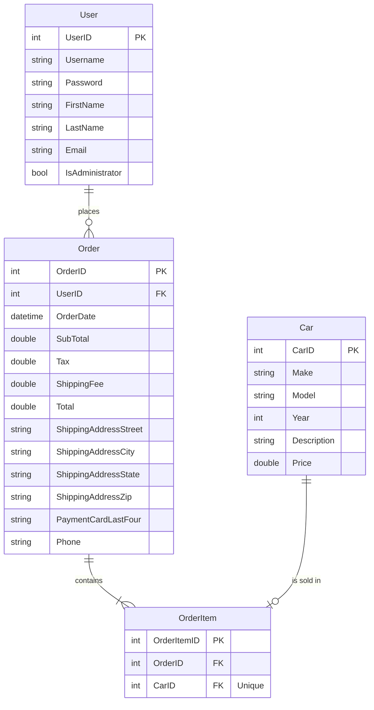

# Technical Design

## Table of Contents

- A. Implementation Language(s)
- B. Implementation Framework(s)
- C. Data Storage Plan
- D. Entity Relationship Diagram (ERD)
- E. Entity/Field Descriptions
- F. Data Examples
- G. Database Seed Data
- H. Authentication and Authorization Plan
- I. Coding Style Guide
- J. Video Presentation

## A. Implementation Language(s)

- **Java 24**: Primary backend language for its strong typing, object-oriented features, and suitability for enterprise-level e-commerce systems. Selected due to team experience and its robustness in data persistence, security, and Spring integration.
  - [Official Java Documentation](https://docs.oracle.com/en/java/javase/23/)
  - [Java Tutorial for Beginners](https://docs.oracle.com/javase/tutorial/)
- **HTML/CSS/JavaScript**: Standard for frontend rendering and interactivity, enabling responsive UIs matching our Marvel mockups.

  - [MDN Web Docs for HTML](https://developer.mozilla.org/en-US/docs/Web/HTML)
  - [MDN Web Docs for CSS](https://developer.mozilla.org/en-US/docs/Web/CSS)
  - [MDN Web Docs for JavaScript](https://developer.mozilla.org/en-US/docs/Web/JavaScript)

## B. Implementation Framework(s)

- **Spring Boot**: Selected as the primary backend framework built on Spring, leveraging Java's strengths for database integration ideal for managing inventory, carts, and orders in our e-commerce system, as required for the shopping cart functionality.
  - [Spring Boot Documentation](https://docs.spring.io/spring-boot/reference/)
  - [Spring Boot Tutorial](https://spring.io/guides/gs/spring-boot/)
- **Bootstrap**: CSS framework for responsive design and pre-built components to accelerate UI development. Specific components include navigation bars for site menus, modals for user interactions like login prompts, and responsive grids for layout adaptability across devices.
  - [Bootstrap Documentation](https://getbootstrap.com/docs/5.3/getting-started/introduction/)
  - [Bootstrap Tutorial](https://www.w3schools.com/bootstrap5/)

## C. Data Storage Plan

- **Database**: SQLite is selected because it provides persistent storage (data survives application restarts). No external server is required.
  - [SQLite Documentation](https://www.sqlite.org/index.html)
- **Libraries and Technologies**:
  - Driver: sqlite-jdbc for JDBC connectivity to SQLite.
- **Implementation Steps**:
  - Configure database connection
  - Define classes for database tables.
  - Create methods for storing and retrieving data.
  - Use scripts for seeding data on startup.
- **Persistence Assurance**: All changes are written to storage, ensuring data durability beyond runtime memory; no fresh start on each launch.

## D. Entity Relationship Diagram (ERD)

## E. Entity/Field Descriptions
### User Table

| Field Name      | Data Type | Key     | Null | Default Value  | Description             |
| --------------- | --------- | ------- | ---- | -------------- | ----------------------- |
| UserID          | Int       | primary | no   | auto increment | Unique ID for each user |
| Username        | String    | Unique  | no   | none           | User login name         |
| Password        | String    |         | no   | none           | Hashed user password    |
| FirstName       | String    |         | no   | none           | User first name         |
| LastName        | String    |         | no   | none           | User last name          |
| Email           | String    |         | no   | none           | User email              |
| IsAdministrator | boolean   |         | no   | FALSE          | User is an admin        |

### Order Table

| Field Name            | Data Type | Key     | Null | Default Value  | Description              |
| --------------------- | --------- | ------- | ---- | -------------- | ------------------------ |
| OrderID               | int       | primary | no   | Auto increment | Unique ID for each order |
| UserID                | int       | foreign | no   | none           | References User          |
| OrderDate             | DateTime  |         | no   | LocalDateTime  | Order Timestamp          |
| SubTotal              | double    |         | no   | 0              | Pre-tax subtotal         |
| Tax                   | double    |         | no   | 0              | Tax amount               |
| ShippingFee           | double    |         | no   | 0              | Shipping cost            |
| Total                 | double    |         | no   | 0              | Final order total        |
| ShippingAddressStreet | String    |         | no   | none           | Street                   |
| ShippingAddressCity   | String    |         | no   | none           | City                     |
| ShippingAddressState   | String    |         | no   | none           | City                     |
| ShippingAddressZip    | String    |         | no   | none           | ZIP code                 |
| PaymentCardLastFour   | String    |         | no   | none           | Last 4 digits of card    |
| Phone                 | String    |         | yes  | none           | Phone number             |

### Car Table

| Field Name  | Data Type | Key     | Null | Default Value  | Description      |
| ----------- | --------- | ------- | ---- | -------------- | ---------------- |
| CarID       | int       | Primary | no   | Auto-Increment | Unique car ID    |
| Make        | String    |         | no   | none           | Car manufacturer |
| Model       | String    |         | no   | none           | Car model        |
| Year        | int       |         | no   | none           | Car year         |
| Description | String    |         | yes  | none           | Car description  |
| Price       | double    |         | no   | 0              | Car price        |

### OrderItem Table

| Field Name  | Data Type | Key     | Null | Default Value  | Description     |
| ----------- | --------- | ------- | ---- | -------------- | --------------- |
| OrderItemID | int       | primary | no   | Auto increment | Line item ID    |
| OrderID     | int       | foreign | no   | none           | Reference Order |
| CarID       | int       | foreign | no   | none           | Reference Car   |

## F. Data Examples
### User Entity

| UserID PK | Username     | Password      | FirstName | LastName | Email              | IsAdminstrator |
|-----------|--------------|---------------|-----------|----------|--------------------|----------------|
| admin     | admin        | admin         | admin     | admin    | revlineadmin@gmail | TRUE           |
| Bobman    | bob123       | billy         | bob       | billybob | billybob@gmail     | FALSE          |
| ballplayer| durant!!!    | kevin         | durant    | kevin    | kevin@gmail        | FALSE          |
| starwars  | greenman?/   | barry         | allen     | yoda     | yoda@gmail         | FALSE          |
| ulookfunny| urgullible101| adam          | sandler   | lookup   | lookup@gmail       | FALSE          |

### Order Entity

| OrderID PK | OrderDate  | SubTotal | Tax | ShippingFee | Total | ShippingAdressStreet | ShippingAdressCity | ShippingAdressState | ShipppingAdressZip | PaymentCardLastFour | Phone         |
|------------|------------|----------|-----|-------------|-------|----------------------|--------------------|---------------------|--------------------|---------------------|---------------|
| 1          | 11/23/2025 | 800      | 20  | 50          | 840   | 320 PeachTree        | St.Simions         | Georiga             | 31522              | 1042                | 770-877-1324  |
| 2          | 11/11/2021 | 2000     | 120 | 50          | 2170  | 1857 BeaverDam       | Marrietta          | Georgia             | 30062              | 2231                | 404-221-7821  |
| 3          | 01/28/2024 | 3500     | 200 | 100         | 3800  | 1234 Elmore          | ToonTown           | Cailfornia          | 54321              | 1111                | 770-444-1121  |
| 4          | 04/23/2025 | 5800     | 400 | 200         | 6400  | 1001 Sunset          | Miami              | Florida             | 10082              | 1001                | 770-902-9901  |
| 5          | 08/08/2027 | 2300     | 100 | 100         | 2500  | 2020 Mountaincreek   | Valleytown         | Montana             | 44462              | 4021                | 404-442-3231  |

### Car Entity

| CarID PK | Make        | Model     | Year | Decription  | Price      |
|----------|-------------|-----------|------|-------------|------------|
| 1        | Porche      | 911       | 2020 | Luxurysport | 98,750     |
| 2        | Lamborghini | aventador | 2015 | Supersport  | 519,999    |
| 3        | Ferrari     | F40       | 1987 | Classic     | ~2,500,000 |
| 4        | Bugatti     | Chiron    | 2022 | Exoticsport | 3,300,000  |
| 5        | Mclaren     | Speedtail | 2021 | Hypersport  | 2,000,000  |

### OrderItem Entity

| OrderItemID | OrderID | CarID |
|-------------|---------|-------|
| 1           | 1       | 1     |
| 2           | 2       | 2     |
| 3           | 3       | 3     |
| 4           | 4       | 4     |
| 5           | 5       | 5     |

## G. Database Seed Data

## H. Authentication and Authorization Plan

- **Technical Approach**: To implement our system’s authentication and authorization functions, our application distinguishes whether a person is a User or an Administrator using the isAdministrator field.

- **Authentication (who is logging in)**
  - Every account is stored in a single User table with fields UserID (PK), Password, Username, FirstName, LastName, Email, Password, and isAdministrator. 
  - Implementation will have one login screen for both Users and Administrators. Users enter Username and Password.
  - On the login screen, backend searches for a user record by Username in the User table.
  - For the entered password, it will then be validated to the stored Password value.
  - If credentials are valid and the account is in the database, the application creates a session for a UserID.

- **Authorization (determines action an authenticated entity can perform)**
  - Following authentication, the system verifies the user’s isAdministrator value stored in their User record.
  - This value categorizes the user’s role inside the system: regular User (isAdministrator = FALSE) or Administrator (isAdministrator = TRUE).
  - Users are permitted to browse cars, manage their shopping cart, and create an order.
  - Administrators have user permissions in addition to being able to manage the car inventory and view all orders in the system.
  - Before executing any command, the backend system reads the session’s UserID and isAdministrator value which then verifies if a current user has the capability to perform the requested command.

## I. Coding Style Guide

- **[Java Style Guide](https://google.github.io/styleguide/javaguide.html)**: The Google Java Guide will be used for our backend Java development. It provides specific rules for commenting, naming, and filename conventions to ensure all team members follow a uniform and readable style of code throughout the application.
  
  - Naming Conventions: UpperCamelCase for classes; camelCase for variables and methods.
  - Filename Conventions: File names must match class names and use .java extensions.
  - Line Length: Break lines that exceed 100 characters.
  - Indentation: Use 2 spaces when indenting (no tabs).
- **[HTML/CSS/Javascript Style Guide](https://developer.mozilla.org/en-US/curriculum/)**: Frontend code is constructed with semantic HTML, an organized external CSS, and focused JavaScript for form behavior. Specific guidelines are followed to maintain a clean, frontend style.
  
  - HTML Structure: Utilize semantic HTML tags `<main>`,`<nav>`,`<section>` for steady page layouts.
  - CSS Structure: Must use descriptive class names (ex: `.user-info`).
  - JavaScript Structure: Write minimal scripts, purely focusing on interactive elements that improve a user's experience.
- **[SQLite Style Guide](https://www.sqlite.org/lang.html)**: SQLite serves as the embedded database for our application, storing data locally and persistently. Our team adheres to defined guidelines to keep database usage simple to maintain.

  - Naming Conventions: Use snake_case for column and table names (ex: order_id).
  - Query Formatting: For clean readability, break long SQLite statements across multiple lines.
- **Source Control Strategy**: Our team follows a [GitFlow](https://www.atlassian.com/git/tutorials/comparing-workflows/gitflow-workflow) style approach to maintain an organized codebase. Each feature has its own branch and pull request which helps us review code before merging.

## J. Video Presentation

- **Video Presentation**: [Watch our Technical Design Presentation on Loom.]()

  
